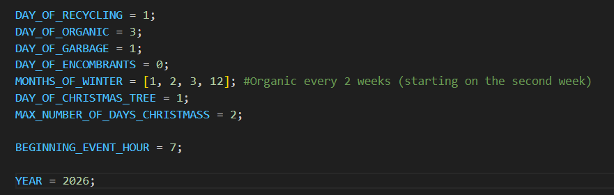
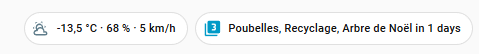
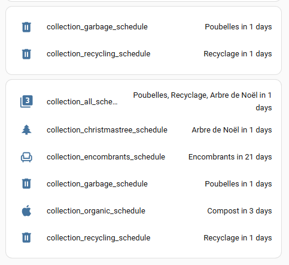

# Garbage Schedule Calendar generator

This project originated from a will to integrate garbage collection into Home Assistant.  Since my town doesn't include a cute json to get the dates, it's impossible to get this information.
But my town is providing a calendar in PDF format for the collection.

It was easy to find out what the schedule are and generate an calendar (ics) file from it.

From there, there is an integration that take this calendar to include it in Home Assistant.

# Warning

This code is heavily dependent on my city garbage collection schedule.  It might not be exactly what you need.

Honestly, there is an integration in hacs (Waste Collection Schedule) that you can specify a simple schedule for each collection.  Depending on your schedule, it might be easier.
Please see  https://github.com/mampfes/hacs_waste_collection_schedule/blob/2.6.0/doc/source/static.md for configuration static sources


# Collection rules

This is what my collection schedule is like

## Garbage

Every week on Tuesday

## Recycling

Every week on Tuesday

## Organics

Every week on Thursday in summer
Every 2 week on Thrusday for January, February, March and December

## Christmass Tree

2 first tuesday of January

## Encombrants (Big Garbage)

Monday, on the last full week of the month.  The last full week is the one with the last friday.

# USAGE

Replace corresponding days in the generator with your personal schedule.



You will have to replace some code also for each type of collection.
For example, for me, Organics are taken each week during the summer, but not in winter (every 2 weeks).  So you'll need to adjust this.

Command line is simple : python create_laval.py

The generated calendar should be put in a directory accessible to your home assistant.
Myself, I put it in www/Garbage.ics

You can change the name as you wish, but you need to put the same directory in the HASSIO configuration.

# HASSIO configuration 

## configuration.yml
```yaml
waste_collection_schedule:
  sources:
    - name: ics
      args:
        file: "www/Garbage.ics"
      customize:
        - type: Garbage
          alias: Poubelles
```

Type is really important as it has to be the same as the "Summary" in the calendar Event.  You can specify an alias for a cuter name.


## sensor.yml
```yaml
- platform: waste_collection_schedule
  name: garbage_schedule
  types:
    - Poubelles

- platform: waste_collection_schedule
  name: next_collection
```

The type must match the alias of the sources (configuration.yml) or the type if you don't use alias.

## Dashboard

Example of ways to display the data : 


